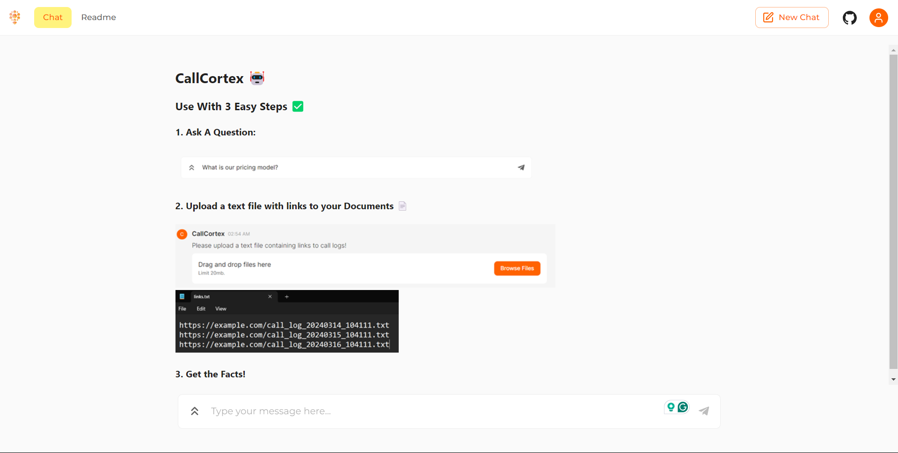
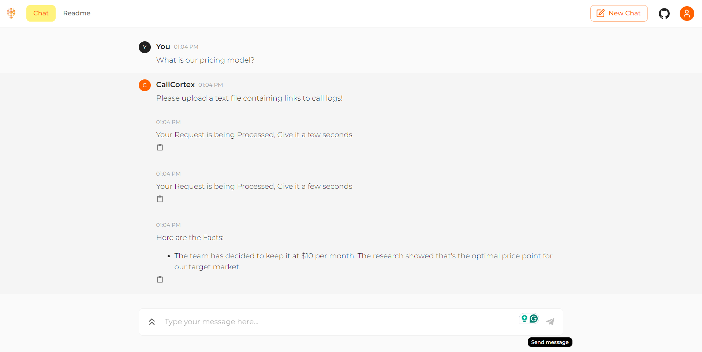

# CallCortex: Intelligent Question Answering for Meeting Logs

> Exploring an agentic approach to using LLMs for Answering Questions about latest updates from Meeting Call Logs

## System Overview

At the core of CallCortex lies the "Agentic Method," that employs 2 collaborative agents to process meeting logs and provide accurate answers to user queries:

- **Fact Extraction Agent:** This agent is responsible for meticulously combing through meeting logs and extracting all relevant facts that might contribute to answering the user's question.

- **Fact Refinement Agent:** The role of this agent is to analyze the extracted facts, filter out any outdated or redundant information, and ensure that the final answer provided to the user is accurate, concise, and relevant.xxe

CallCortex incorporates several key components to enhance its functionality and efficiency:

- **SQL Database:** A SQL database is utilized to store extracted facts, questions, and document links, enabling efficient retrieval and reducing redundant processing when no new data is added.

- **Prompt Compression:** LLMingua is employed to compress prompts by removing unnecessary tokens, optimizing API call costs and improving performance.

- **Similarity Search:** FAISS, a powerful similarity search library, is used to retrieve the most relevant information from meeting logs before processing, reducing the context length and token usage.

- **User-Friendly Interface:** CallCortex features a simple and intuitive chat interface powered by Chainlit, providing users with a seamless experience and clear visual aids for interacting with the system.

## Design Principles

CallCortex was developed with the following design principles in mind:

- **Scalability:** The system is designed to handle large volumes of meeting logs and queries efficiently, ensuring responsive performance even under heavy loads.

- **Extensibility:** CallCortex's modular architecture allows for easy integration of new data sources, LLM models, or query understanding techniques, facilitating future enhancements and customizations.

- **Interpretability:** Transparency for devs is a core feature of CallCortex. The system shows us the reasoning process behind the generated responses, fostering trust and understanding.

- **User Experience:** The intuitive and user-friendly interface ensures a seamless interaction with the system.

## Future Enhancements
Some planned future enhancements include:

- **Intent Understanding:** Incorporating intent understanding capabilities using libraries like sentence-transformers to retrieve relevant facts from the database based on the intent behind the user's question.

- **Model Fine-tuning:** Exploring fine-tuned models for improved retrieval-augmented generation (RAG) and prompt compression, further enhancing the system's performance and accuracy.

- **Better loading graphic:** impoves user experience

<!-- ## Getting Started -->

